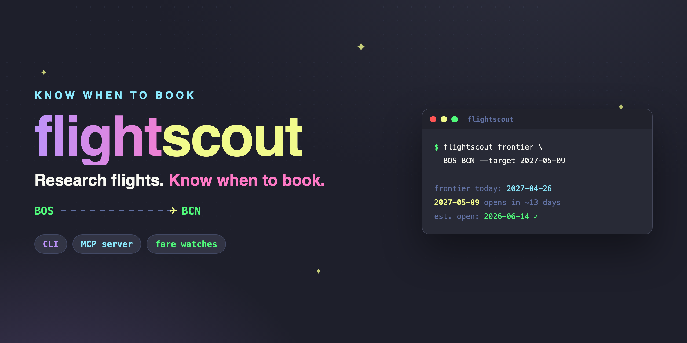

# flightscout



**Research flights and know *when* to book.** flightscout is a flight-research and fare-watch toolkit built on top of [`fli`](https://github.com/punitarani/fli) (Google Flights data): round-trip and flexible search, multi-airport compare, a booking-frontier "when does my date open?" tool, and reliable availability and price watches with pluggable alerts. It runs as a CLI and as an [MCP](https://modelcontextprotocol.io) server, so an assistant can do the work for you.

[](LICENSE)


## Why flightscout

Raw `fli` already searches Google Flights well. flightscout adds the three things you actually reach for when planning a trip:

1. **Booking-frontier ETA.** Airlines only sell on a rolling horizon (commonly ~330 to 360 days out), so a date further out is not bookable yet. flightscout binary-searches the furthest bookable date for your route and, given a target date, estimates the calendar day it will open for booking. No more guessing or refreshing.
2. **Reliable watches.** Availability and price watches that fire exactly once, latch detection separately from delivery so a transient error never loses an alert, and ship a dead-man's-switch that warns you if a watch quietly breaks.
3. **Agent-native.** A built-in MCP server and a drop-in Claude skill mean you can ask an assistant to "find me the cheapest week to fly BOS to BCN in May and watch it" instead of memorizing flags.

Cash fares only. No award or points availability.

## Install

```bash
pip install flightscout              # the `flightscout` CLI (typer + rich included)
pip install "flightscout[mcp]"       # also installs the `flightscout-mcp` server
pip install "flightscout[all]"       # everything
```

flightscout needs the `fli` engine, which is pulled in automatically via the `flights` dependency on PyPI. If you install with `pipx` and hit a missing-dependency error on Python 3.14, inject the click extra that `fli` expects:

```bash
pipx install flightscout
pipx inject flightscout flights click
```

Data (watch definitions and fired-state) lives under `~/.flightscout` by default. Set `FLIGHTSCOUT_HOME` to relocate it (useful for keeping independent state per machine).

## Quickstart

All examples use BOS to BCN (Boston to Barcelona). Swap in any IATA codes.

```bash
# Search a specific date
flightscout search BOS BCN 2026-05-09

# Round trip
flightscout search BOS BCN 2026-05-09 --return 2026-05-16

# Cheapest departure dates across a window
flightscout cheapest BOS BCN --from 2026-05-01 --to 2026-05-31

# Cheapest fare within +/- 3 days of a target date
flightscout flexible BOS BCN 2026-05-09 --window 3

# Fan out across nearby airports and merge by price
flightscout compare BOS,PVD,MHT BCN,GRO 2026-05-09

# When does this route's booking window open out to my date?
flightscout frontier BOS BCN --target 2027-05-09

# Watch a future trip: fire when it opens for booking
flightscout watch add availability BOS BCN 2027-05-09 --label "Spain anniversary"

# Watch for a price drop
flightscout watch add price BOS BCN 2026-05-09 --threshold 450

# List, check, and remove watches
flightscout watch list
flightscout watch check
flightscout watch rm bos-bcn-2026-05-09-economy-price

# Fare history + a "good time to book?" read on a watch
flightscout history bos-bcn-2026-05-09-economy-price
```

Add `--json` to any command to get the raw dict instead of a rendered table.

## When does my trip open for booking?

This is flightscout's signature move. Ask about a date that is too far out to book today:

```bash
flightscout frontier BOS BCN --target 2027-05-09
```

flightscout probes the live route, finds the current booking frontier (the furthest date on sale), and tells you whether your target is bookable now. If it is not, it estimates the calendar date the target will open. Pair it with an availability watch and you will be alerted the day it does:

```bash
flightscout watch add availability BOS BCN 2027-05-09 --label "open me"
```

## Agent / MCP

flightscout ships an MCP server exposing search, cheapest-dates, flexible-dates, the booking frontier, and full watch CRUD as tools. Point any MCP client at the `flightscout-mcp` entry point.

For Claude Desktop, add this to `claude_desktop_config.json`:

```json
{
  "mcpServers": {
    "flightscout": {
      "command": "flightscout-mcp"
    }
  }
}
```

There is also a drop-in Claude Code skill at [`skill/flights.md`](skill/flights.md) that narrates the CLI for an assistant that prefers to shell out.

## Watches and alerts

A watch tracks one route and date and fires once:

- **availability** fires when the date becomes bookable (great for dates beyond the current frontier).
- **price** fires when the cheapest fare drops to at or below your `--threshold`.

Reliability is the point. Detection is latched in state separately from notification, so a notifier outage on the firing day cannot lose the alert: it keeps retrying until delivery succeeds. After a few consecutive errored checks, a **dead-man's-switch** alert tells you the watch itself may be broken. Run `flightscout watch check --notify` from cron to drive delivery.

Alerts fan out to any of six notifiers, configured in a TOML file or via environment variables:

| Notifier   | Delivers via                              |
| ---------- | ----------------------------------------- |
| `console`  | stdout (zero-config default)              |
| `email`    | SMTP (text + HTML)                        |
| `telegram` | Telegram Bot API                          |
| `discord`  | Discord channel webhook                   |
| `ntfy`     | ntfy.sh-style topic                       |
| `webhook`  | generic JSON POST                         |

See [`examples/config.example.toml`](examples/config.example.toml) for every block and its env-var equivalent.

Every check also logs the day's cheapest fare. `flightscout history <watch-id>` shows the trend and tells you where today sits versus the recent median, a simple, honest "good time to book?" read with no predictions. Watches and history live under `~/.flightscout` (override with `FLIGHTSCOUT_HOME`).

## Disclaimer

> flightscout reads from **Google Flights' unofficial endpoint** by way of `fli`. That endpoint is undocumented and can change or break without notice. It is rate-limited, so keep your volume low and your watch cadence gentle. flightscout returns **cash fares only**: no miles, award, or points availability. This project is **not affiliated with, endorsed by, or sponsored by Google**. Use it for personal research and book through official channels. All credit for the underlying Google Flights client goes to the [`fli` project](https://github.com/punitarani/fli).

## Roadmap

- Round-trip watches (current watches are one-way legs)
- "Explore anywhere under $X" open-destination search
- Price-trend charts from recorded fare history
- A hosted option so watches run without your own cron

## License

MIT. See [LICENSE](LICENSE).
